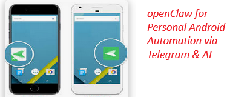

# Telegram Claw

> OpenClaw for Android — built for people, not developers.



You want to know if your elderly parent is okay. Whether your kid got home. Whether your partner is awake.
You don't want to call. You don't want to install an app on their phone and explain how it works.
You just want to send a message — and get an answer.

---

**"Is he sleeping?"**

You send that to a Telegram bot. Telegram Claw reads the device sensors, checks the screen state,
looks at motion and ambient light, and replies:

> *"Phone hasn't moved in 2 hours, screen is off, room is dark. Probably sleeping."*

No commands. No syntax. No technical knowledge required from the sender.

---

## For the technically curious

Natural language → **Claude AI** → Android hardware control — over Telegram, with no cloud dependency.

Each person creates a dedicated Telegram bot (2 minutes, free via BotFather).
A self-hosted Java relay server receives Telegram messages, calls the Claude API to parse intent,
and pushes structured commands to the Android device via FCM.
The Android app executes locally, checks permissions, and sends the result back.

```
Person A types:   "Turn up his ringer, I need to reach him urgently"
                              ↓
         Claude identifies:   audio_manager { stream: RING, level: 100, force_ping: true }
                              ↓
         Android executes:    ringer set to maximum, silent mode overridden
                              ↓
         Person A receives:   "Ringer set to maximum. Silent mode overridden."
```

Everything runs on your own infrastructure. No Telegram Claw servers see your messages.

---

## 6 Things You Can Do

| Tool | What it does | Permission |
|---|---|---|
| `get_device_context` | Battery, screen state, sound profile, motion, ambient light | None — passive sensors |
| `media_control` | Play, pause, skip, or open a Spotify/YouTube link | None |
| `audio_manager` | Set volume or force a loud alert ping through silent mode | WRITE_SETTINGS (one-time) |
| `notification_sender` | Display a message as toast, notification, or fullscreen alert | POST_NOTIFICATIONS |
| `location_fetcher` | Get current GPS coordinates | Always requires confirmation |
| `camera_capture` | Take a photo and receive it in Telegram | Always requires confirmation |

---

## 8 Security Protocols

Telegram Claw is built around the principle that the device owner is always in control.

1. **Human-in-the-Loop** — sensitive commands (location, camera) always show a confirmation dialog. 60-second timeout → auto-deny.
2. **End-to-End Encryption** — commands are RSA-encrypted with the device's public key. Only the Android Keystore can decrypt them. The relay server never sees the payload.
3. **Permission Manifest** — every tool is off by default. The device owner explicitly enables each one.
4. **TTL-Limited Tokens** — access expires. Options: 2h / 24h / 7 days / permanent. Expired = message dropped.
5. **Transparent Audit Log** — every executed and denied command is written to an immutable on-device log. Export to CSV.
6. **Out-of-Band Pairing** — authorization happens via QR code or SMS PIN, never via Telegram itself. Knowing the bot username grants nothing.
7. **SMS Kill Switch** — if the authorized user's Telegram account is compromised, one SMS revokes all access. Works offline.
8. **Rate Limiting + Auto-Freeze** — more than 10 commands in 60 seconds triggers an automatic sender freeze and notifies the device owner.

---

## Architecture

```
Person A (Telegram)
        │  message: "Is he sleeping?"
        ▼
Telegram Bot API  ──HTTPS POST──►  Relay Server (Java / Maven)
                                         │
                                         │  Claude API (intent parsing)
                                         │  audio_manager { level: 100 }
                                         │
                                         │  FCM push (encrypted)
                                         ▼
                                   Android Claw App
                                         │
                                         │  checks PermissionManifest
                                         │  shows confirmation if needed
                                         │  executes via Android APIs
                                         │  writes to AuditLogger
                                         ▼
                                   Result → Relay → Telegram sendMessage → Person A
```

**Two modules:**
- `telegram-claw-relay` — Java 21, Maven, self-hosted relay server (BSL 1.1)
- `telegram-claw-android` — Java, Android 8.0+, the Claw app on the device (Apache 2.0)

---

## Current Status

> `v0.1.0` — Relay server complete. Android app in development (Phase 2).

**What works right now:**

| | |
|---|---|
| ✅ | Relay server receives Telegram messages via webhook |
| ✅ | Claude AI parses natural language into structured tool calls |
| ✅ | All 6 tool definitions built and sent to Claude on every message |
| ✅ | FCM push — command dispatched to Android device via Firebase |
| ✅ | Telegram reply sent back to Person A in natural language |
| ✅ | Authorization — Telegram user ID whitelist (only approved senders accepted) |
| ✅ | Rate limiting — auto-freeze on command flood (Protocol 8) |
| ✅ | Full chain smoke-tested end-to-end |
| 🔜 | Android app — command execution on device (Phase 2) |
| 🔜 | Security protocols — encryption, pairing, kill switch (Phase 3) |

**Want to try it today?**

You can run the relay server locally and watch the full chain work in real time —
no Android device needed yet. Three guides walk you through it step by step:

1. [`docs/smoke-test-phase1.md`](telegram-claw-relay/docs/smoke-test-phase1.md) — get the relay server running and receive your first Telegram message
2. [`docs/smoke-test-phase1-day3-4.md`](telegram-claw-relay/docs/smoke-test-phase1-day3-4.md) — send *"Is he sleeping?"* and watch Claude decide which tool to call
3. [`docs/smoke-test-phase1-day5-6.md`](telegram-claw-relay/docs/smoke-test-phase1-day5-6.md) — FCM push dispatched to a real Android device

All you need: Java 21, Maven, a Telegram bot token (free, 2 minutes via BotFather), and an Anthropic API key.

> **Note:** During development, the relay server uses the Anthropic API (Claude Haiku) for intent parsing.
> The planned default for the stable release is the **Groq API** — which has a free tier of 14,400 requests/day,
> meaning typical personal use costs nothing. The model is switchable via a single environment variable;
> no code changes required.

---

## Roadmap

| Tag | What's included |
|---|---|
| `v0.1.0` | Relay server: Telegram webhook + Claude intent parsing + FCM dispatch |
| `v0.2.0` | Android app: first real tool working end-to-end (`audio_manager`) |
| `v0.3.0` | All 6 tools + all 8 security protocols |
| `v1.0.0` | Stable release: relay + Android + docs + self-hosting guide |

---

## Self-Hosting

Telegram Claw is designed to be self-hosted. You own everything:

- Your Telegram bot (created in 2 minutes via [@BotFather](https://t.me/BotFather))
- Your relay server (a single JAR, runs anywhere Java 21 runs)
- Your Anthropic API key (Claude Haiku — approximately $0.0003 per command)
- Your Android device (the Claw app installed as an APK)

Setup guides:
- [`docs/smoke-test-phase1.md`](telegram-claw-relay/docs/smoke-test-phase1.md) — get the relay server running locally
- [`docs/smoke-test-phase1-day3-4.md`](telegram-claw-relay/docs/smoke-test-phase1-day3-4.md) — verify Claude intent parsing works

Full self-hosting guide coming with `v1.0.0`.

---

## Why Not Just Use...

| Tool | What's missing |
|---|---|
| Google Find My Device | Only your own device, no AI, no extensibility |
| DroidRun / zerotap | No Telegram, no P2P, requires a PC, developer tool only |
| OpenClaw | Explicit command syntax required — no natural language, no AI |
| Telegram bots (DIY) | You'd have to build everything in this repo yourself |

The gap Telegram Claw fills: **natural language + proper Android permissions + self-hosted + no technical knowledge required from the sender.**

---

## Licensing

| Module | License |
|---|---|
| `telegram-claw-android` | [Apache 2.0](LICENSE-APACHE) — free for everyone |
| `telegram-claw-relay` | [Business Source License 1.1](LICENSE-BSL) — free for personal use; commercial hosting requires a license |
| `telegram-claw-enterprise` | Proprietary — commercial tools, contact TabForge |

BSL 1.1 converts to Apache 2.0 four years after first public release.
Self-hosting for personal or family use is explicitly permitted under BSL 1.1.

---

## Contributing

This project follows a split-license model. Contributions to `telegram-claw-android` (Apache 2.0)
are straightforward. Contributions to `telegram-claw-relay` (BSL 1.1) require a CLA to ensure
the license terms remain enforceable.

CLA and contribution guide coming with `v0.1.0`.

---

Built by [TabForge](https://github.com/tabforgeai).